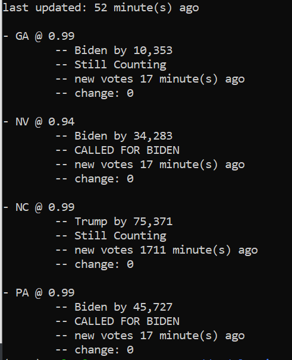

### My automated elections monitoring script

While largely unnecessary, this took out the stres of refreshing the Politico election map every 5 minutes
---

This script operates by pullilng the Politico Presidential Race Update JSON which is updated every 10-30 seconds (Idenfited via on-site network request).
```
The format of the relevant pieces of the file is: 
{
    lastUpdated: {{datetime for the last time any state was updated}},
    races: [
        {
            stateFips: {{5 Digit State ID}},
            progressPct: {{expected fraction of votes returned}},
            candidates: [
                {
                    candidateId: {{5 digit candidate ID, different per state}},
                    votes: {{integer count of votes received}},
                    winner: {{boolean flag for if the state was called for this candidate}}
                }, ...
            ]
        }, ...
    ]
}
```
This script parses that document and returns the values for GA, NV, NC, and PA along with when they were last updated and if the states have been called. 

I've had the best luck calling this with the `watch` command, updating the file every 60 seconds
```
watch -n 60 python main.py
```


